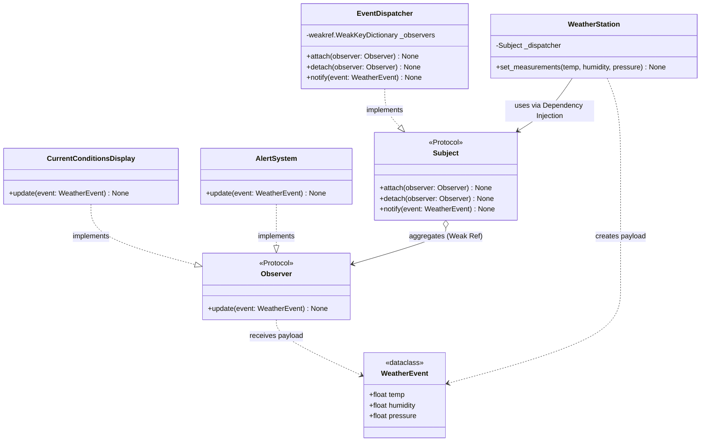
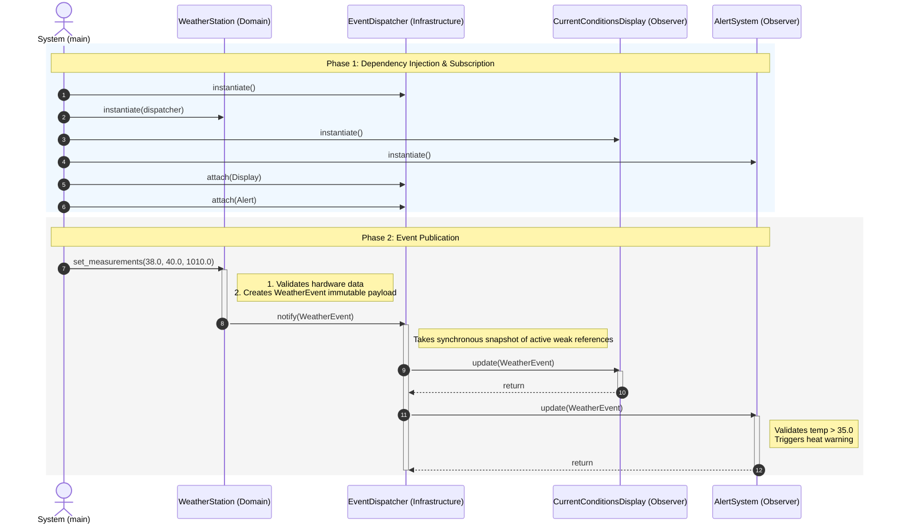

Class Diagram

```mermaid
classDiagram
    %% 1. Define Interfaces (Protocols)
    class Subject {
        <<Protocol>>
        +attach(observer: Observer) None
        +detach(observer: Observer) None
        +notify(event: WeatherEvent) None
    }

    class Observer {
        <<Protocol>>
        +update(event: WeatherEvent) None
    }

    %% 2. Define Concrete Infrastructure
    class EventDispatcher {
        -weakref.WeakKeyDictionary _observers
        +attach(observer: Observer) None
        +detach(observer: Observer) None
        +notify(event: WeatherEvent) None
    }

    %% 3. Define Domain Payload
    class WeatherEvent {
        <<dataclass>>
        +float temp
        +float humidity
        +float pressure
    }

    %% 4. Define Domain Logic
    class WeatherStation {
        -Subject _dispatcher
        +set_measurements(temp, humidity, pressure) None
    }

    %% 5. Define Concrete Observers
    class CurrentConditionsDisplay {
        +update(event: WeatherEvent) None
    }

    class AlertSystem {
        +update(event: WeatherEvent) None
    }

    %% 6. Draw Relationships
    %% Realization (Implementation)
    EventDispatcher ..|> Subject : implements
    CurrentConditionsDisplay ..|> Observer : implements
    AlertSystem ..|> Observer : implements

    %% Dependencies and Aggregation
    WeatherStation --> Subject : uses via Dependency Injection
    Subject o--> Observer : aggregates (Weak Ref)
    Observer ..> WeatherEvent : receives payload
    WeatherStation ..> WeatherEvent : creates payload
```

Sequence Diagram

```mermaid
sequenceDiagram
    autonumber
    
    actor Main as System (main)
    participant Station as WeatherStation (Domain)
    participant Dispatcher as EventDispatcher (Infrastructure)
    participant Display as CurrentConditionsDisplay (Observer)
    participant Alert as AlertSystem (Observer)

    %% System Bootstrapping (The Wiring)
    rect rgb(240, 248, 255)
        note over Main, Alert: Phase 1: Dependency Injection & Subscription
        Main->>Dispatcher: instantiate()
        Main->>Station: instantiate(dispatcher)
        Main->>Display: instantiate()
        Main->>Alert: instantiate()
        
        Main->>Dispatcher: attach(Display)
        Main->>Dispatcher: attach(Alert)
    end

    %% Runtime Event Execution
    rect rgb(245, 245, 245)
        note over Main, Alert: Phase 2: Event Publication
        Main->>Station: set_measurements(38.0, 40.0, 1010.0)
        
        activate Station
        note right of Station: 1. Validates hardware data<br/>2. Creates WeatherEvent immutable payload
        Station->>Dispatcher: notify(WeatherEvent)
        deactivate Station
        
        activate Dispatcher
        note right of Dispatcher: Takes synchronous snapshot of active weak references
        
        %% Notification Loop
        Dispatcher->>Display: update(WeatherEvent)
        activate Display
        Display-->>Dispatcher: return
        deactivate Display
        
        Dispatcher->>Alert: update(WeatherEvent)
        activate Alert
        note right of Alert: Validates temp > 35.0<br/>Triggers heat warning
        Alert-->>Dispatcher: return
        deactivate Alert
        
        deactivate Dispatcher
    end
```