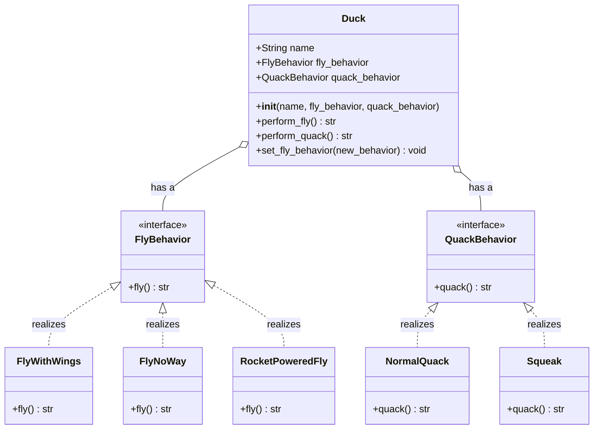
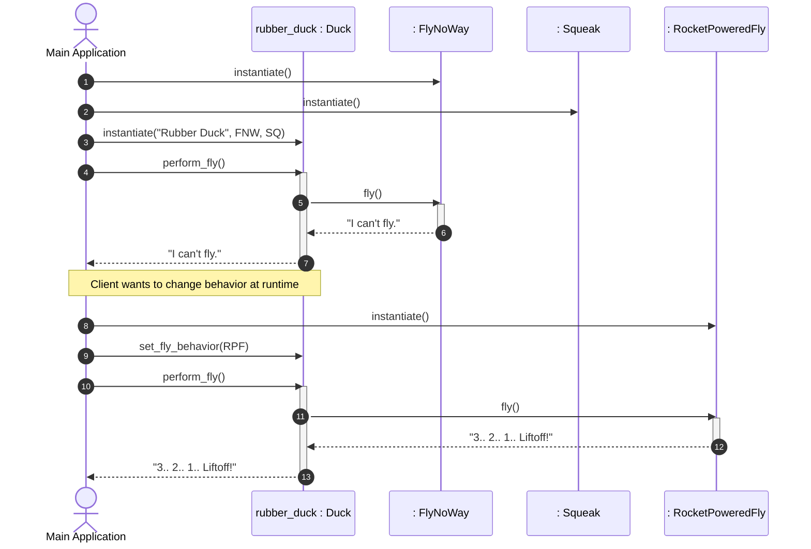

Class Diagram

```mermaid
classDiagram
    %% The Context
    class Duck {
        +String name
        +FlyBehavior fly_behavior
        +QuackBehavior quack_behavior
        +__init__(name, fly_behavior, quack_behavior)
        +perform_fly() str
        +perform_quack() str
        +set_fly_behavior(new_behavior) void
    }

    %% The Interfaces (Protocols in Python)
    class FlyBehavior {
        <<interface>>
        +fly() str
    }
    
    class QuackBehavior {
        <<interface>>
        +quack() str
    }

    %% Concrete Strategies for Flying
    class FlyWithWings {
        +fly() str
    }
    class FlyNoWay {
        +fly() str
    }
    class RocketPoweredFly {
        +fly() str
    }
    
    %% Concrete Strategies for Quacking
    class NormalQuack {
        +quack() str
    }
    class Squeak {
        +quack() str
    }

    %% UML Relationships
    %% Duck aggregates the behavior interfaces (Dependency Inversion)
    Duck o-- FlyBehavior : has a
    Duck o-- QuackBehavior : has a
    
    %% Concrete classes implement (realize) the interfaces / protocols
    FlyBehavior <|.. FlyWithWings : realizes
    FlyBehavior <|.. FlyNoWay : realizes
    FlyBehavior <|.. RocketPoweredFly : realizes
    
    QuackBehavior <|.. NormalQuack : realizes
    QuackBehavior <|.. Squeak : realizes
```

Sequence Diagram

```mermaid
sequenceDiagram
    autonumber
    actor Client as Main Application
    participant RD as rubber_duck : Duck
    participant FNW as : FlyNoWay
    participant SQ as : Squeak
    participant RPF as : RocketPoweredFly

    %% Instantiation
    Client->>FNW: instantiate()
    Client->>SQ: instantiate()
    Client->>RD: instantiate("Rubber Duck", FNW, SQ)
    
    %% Initial Behavior Execution
    Client->>RD: perform_fly()
    activate RD
    RD->>FNW: fly()
    activate FNW
    FNW-->>RD: "I can't fly."
    deactivate FNW
    RD-->>Client: "I can't fly."
    deactivate RD

    %% Runtime Mutation (Liskov Substitution & Open/Closed in action)
    Note over Client,RD: Client wants to change behavior at runtime
    Client->>RPF: instantiate()
    Client->>RD: set_fly_behavior(RPF)
    
    %% New Behavior Execution
    Client->>RD: perform_fly()
    activate RD
    RD->>RPF: fly()
    activate RPF
    RPF-->>RD: "3.. 2.. 1.. Liftoff!"
    deactivate RPF
    RD-->>Client: "3.. 2.. 1.. Liftoff!"
    deactivate RD
```
