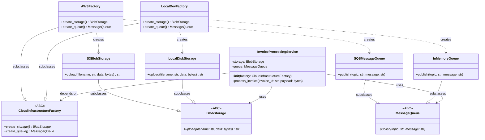
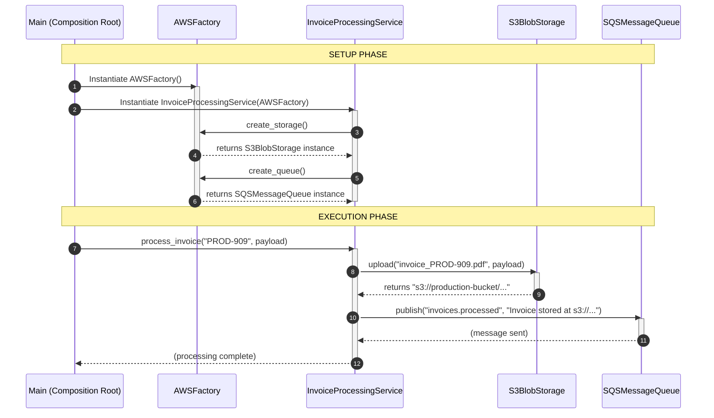

Class Diagram

```mermaid
classDiagram
    %% -------------------------------------
    %% 1. ABSTRACT BASE CLASSES (The Interfaces)
    %% -------------------------------------
    class BlobStorage {
        <<ABC>>
        +upload(filename: str, data: bytes) str*
    }

    class MessageQueue {
        <<ABC>>
        +publish(topic: str, message: str)*
    }

    class CloudInfrastructureFactory {
        <<ABC>>
        +create_storage() BlobStorage*
        +create_queue() MessageQueue*
    }

    %% -------------------------------------
    %% 2. CONCRETE PRODUCTS
    %% -------------------------------------
    class S3BlobStorage {
        +upload(filename: str, data: bytes) str
    }
    class LocalDiskStorage {
        +upload(filename: str, data: bytes) str
    }
    
    class SQSMessageQueue {
        +publish(topic: str, message: str)
    }
    class InMemoryQueue {
        +publish(topic: str, message: str)
    }

    %% -------------------------------------
    %% 3. CONCRETE FACTORIES
    %% -------------------------------------
    class AWSFactory {
        +create_storage() BlobStorage
        +create_queue() MessageQueue
    }
    class LocalDevFactory {
        +create_storage() BlobStorage
        +create_queue() MessageQueue
    }

    %% -------------------------------------
    %% 4. CLIENT
    %% -------------------------------------
    class InvoiceProcessingService {
        -storage: BlobStorage
        -queue: MessageQueue
        +__init__(factory: CloudInfrastructureFactory)
        +process_invoice(invoice_id: str, payload: bytes)
    }

    %% -------------------------------------
    %% RELATIONSHIPS
    %% -------------------------------------
    %% Products subclassing ABCs
    S3BlobStorage --|> BlobStorage : subclasses
    LocalDiskStorage --|> BlobStorage : subclasses
    
    SQSMessageQueue --|> MessageQueue : subclasses
    InMemoryQueue --|> MessageQueue : subclasses
    
    %% Factories subclassing ABCs
    AWSFactory --|> CloudInfrastructureFactory : subclasses
    LocalDevFactory --|> CloudInfrastructureFactory : subclasses

    %% Factories creating specific families
    AWSFactory ..> S3BlobStorage : creates
    AWSFactory ..> SQSMessageQueue : creates
    
    LocalDevFactory ..> LocalDiskStorage : creates
    LocalDevFactory ..> InMemoryQueue : creates

    %% Client relying ONLY on ABCs
    InvoiceProcessingService --> CloudInfrastructureFactory : depends on
    InvoiceProcessingService --> BlobStorage : uses
    InvoiceProcessingService --> MessageQueue : uses
```

Sequence Diagram

```mermaid
sequenceDiagram
    autonumber
    
    participant Main as Main (Composition Root)
    participant Factory as AWSFactory
    participant Service as InvoiceProcessingService
    participant Storage as S3BlobStorage
    participant Queue as SQSMessageQueue

    Note over Main,Queue: SETUP PHASE

    Main->>Factory: Instantiate AWSFactory()
    activate Factory
    Main->>Service: Instantiate InvoiceProcessingService(AWSFactory)
    activate Service
    
    Service->>Factory: create_storage()
    Factory-->>Service: returns S3BlobStorage instance
    
    Service->>Factory: create_queue()
    Factory-->>Service: returns SQSMessageQueue instance
    deactivate Factory
    deactivate Service

    Note over Main,Queue: EXECUTION PHASE

    Main->>Service: process_invoice("PROD-909", payload)
    activate Service
    
    Service->>Storage: upload("invoice_PROD-909.pdf", payload)
    activate Storage
    Storage-->>Service: returns "s3://production-bucket/..."
    deactivate Storage

    Service->>Queue: publish("invoices.processed", "Invoice stored at s3://...")
    activate Queue
    Queue-->>Service: (message sent)
    deactivate Queue
    
    Service-->>Main: (processing complete)
    deactivate Service
```
