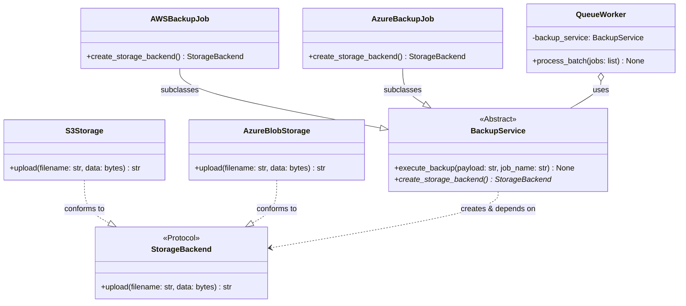
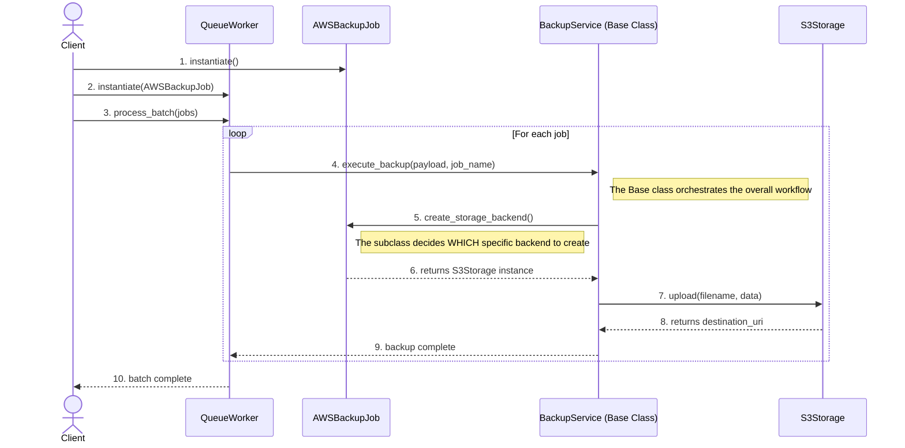

Class Diagram

```mermaid
classDiagram
    %% The Product Protocol
    class StorageBackend {
        <<Protocol>>
        +upload(filename: str, data: bytes) str
    }

    %% Concrete Products
    class S3Storage {
        +upload(filename: str, data: bytes) str
    }
    class AzureBlobStorage {
        +upload(filename: str, data: bytes) str
    }

    S3Storage ..|> StorageBackend : conforms to
    AzureBlobStorage ..|> StorageBackend : conforms to

    %% The Creator Base Class
    class BackupService {
        <<Abstract>>
        +execute_backup(payload: str, job_name: str) None
        +create_storage_backend()* StorageBackend
    }

    %% Concrete Creators
    class AWSBackupJob {
        +create_storage_backend() StorageBackend
    }
    class AzureBackupJob {
        +create_storage_backend() StorageBackend
    }

    AWSBackupJob --|> BackupService : subclasses
    AzureBackupJob --|> BackupService : subclasses

    %% Relationships
    BackupService ..> StorageBackend : creates & depends on
    
    %% The Client Code
    class QueueWorker {
        -backup_service: BackupService
        +process_batch(jobs: list) None
    }
    
    QueueWorker o-- BackupService : uses
```

Sequence Diagram

```mermaid
sequenceDiagram
    actor Client
    participant Worker as QueueWorker
    participant Job as AWSBackupJob
    participant Base as BackupService (Base Class)
    participant Backend as S3Storage

    %% Bootstrapping
    Client->>Job: 1. instantiate()
    Client->>Worker: 2. instantiate(AWSBackupJob)
    
    %% Execution
    Client->>Worker: 3. process_batch(jobs)
    
    loop For each job
        Worker->>Base: 4. execute_backup(payload, job_name)
        Note right of Base: The Base class orchestrates the overall workflow
        
        %% The Factory Method Call
        Base->>Job: 5. create_storage_backend()
        Note right of Job: The subclass decides WHICH specific backend to create
        Job-->>Base: 6. returns S3Storage instance
        
        %% Using the Product
        Base->>Backend: 7. upload(filename, data)
        Backend-->>Base: 8. returns destination_uri
        
        Base-->>Worker: 9. backup complete
    end
    
    Worker-->>Client: 10. batch complete
```
