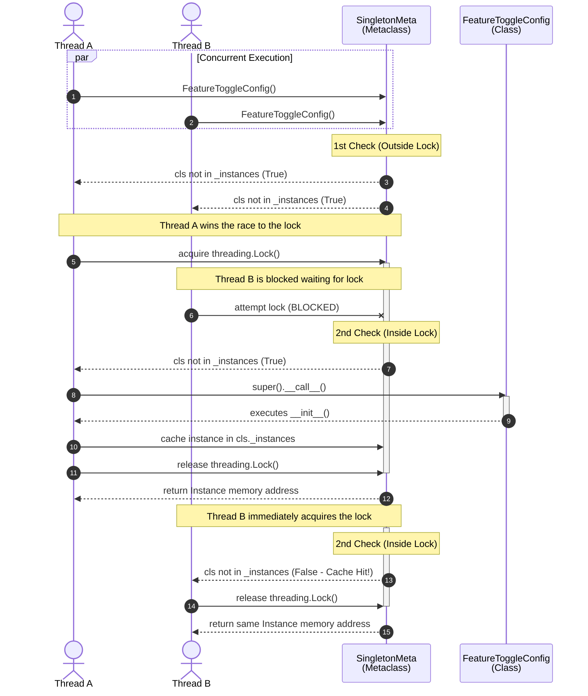

Sequence Diagram

```mermaid
sequenceDiagram
    autonumber
    actor ThreadA as Thread A
    actor ThreadB as Thread B
    participant Meta as SingletonMeta<br>(Metaclass)
    participant Config as FeatureToggleConfig<br>(Class)

    par Concurrent Execution
        ThreadA->>Meta: FeatureToggleConfig()
        ThreadB->>Meta: FeatureToggleConfig()
    end

    Note over Meta: 1st Check (Outside Lock)
    Meta-->>ThreadA: cls not in _instances (True)
    Meta-->>ThreadB: cls not in _instances (True)

    Note over ThreadA,Meta: Thread A wins the race to the lock
    ThreadA->>Meta: acquire threading.Lock()
    activate Meta
    
    Note over ThreadB,Meta: Thread B is blocked waiting for lock
    ThreadB-xMeta: attempt lock (BLOCKED)
    
    Note over Meta: 2nd Check (Inside Lock)
    Meta-->>ThreadA: cls not in _instances (True)
    
    ThreadA->>Config: super().__call__()
    activate Config
    Config-->>ThreadA: executes __init__()
    deactivate Config
    
    ThreadA->>Meta: cache instance in cls._instances
    ThreadA->>Meta: release threading.Lock()
    deactivate Meta
    
    Meta-->>ThreadA: return Instance memory address

    Note over ThreadB,Meta: Thread B immediately acquires the lock
    activate Meta
    
    Note over Meta: 2nd Check (Inside Lock)
    Meta-->>ThreadB: cls not in _instances (False - Cache Hit!)
    
    ThreadB->>Meta: release threading.Lock()
    deactivate Meta
    
    Meta-->>ThreadB: return same Instance memory address
```
