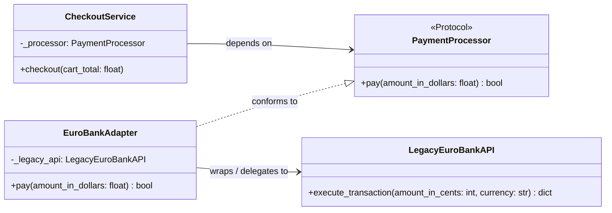
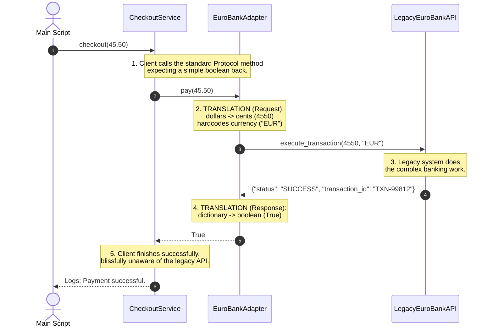

Class Diagram

```mermaid
classDiagram
    direction LR
    
    class CheckoutService {
        -_processor: PaymentProcessor
        +checkout(cart_total: float)
    }
    
    class PaymentProcessor {
        <<Protocol>>
        +pay(amount_in_dollars: float) bool
    }
    
    class EuroBankAdapter {
        -_legacy_api: LegacyEuroBankAPI
        +pay(amount_in_dollars: float) bool
    }
    
    class LegacyEuroBankAPI {
        +execute_transaction(amount_in_cents: int, currency: str) dict
    }
    
    %% Relationships
    CheckoutService --> PaymentProcessor : depends on
    EuroBankAdapter ..|> PaymentProcessor : conforms to
    EuroBankAdapter --> LegacyEuroBankAPI : wraps / delegates to
```

Sequence Diagram

```mermaid
sequenceDiagram
    autonumber
    
    actor User as Main Script
    participant Client as CheckoutService
    participant Adapter as EuroBankAdapter
    participant Adaptee as LegacyEuroBankAPI

    User->>Client: checkout(45.50)
    
    Note over Client,Adapter: 1. Client calls the standard Protocol method<br/>expecting a simple boolean back.
    Client->>Adapter: pay(45.50)
    
    Note over Adapter: 2. TRANSLATION (Request):<br/>dollars -> cents (4550)<br/>hardcodes currency ("EUR")
    
    Adapter->>Adaptee: execute_transaction(4550, "EUR")
    
    Note over Adaptee: 3. Legacy system does<br/>the complex banking work.
    Adaptee-->>Adapter: {"status": "SUCCESS", "transaction_id": "TXN-99812"}
    
    Note over Adapter: 4. TRANSLATION (Response):<br/>dictionary -> boolean (True)
    
    Adapter-->>Client: True
    
    Note over Client: 5. Client finishes successfully,<br/>blissfully unaware of the legacy API.
    Client-->>User: Logs: Payment successful.
```
