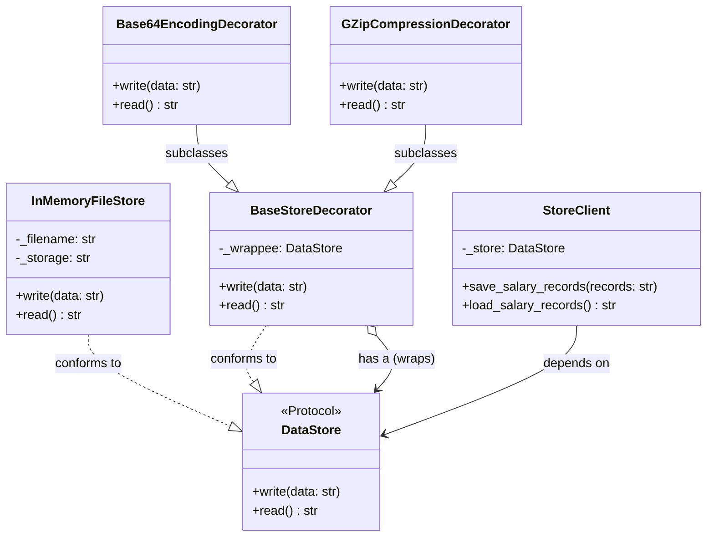
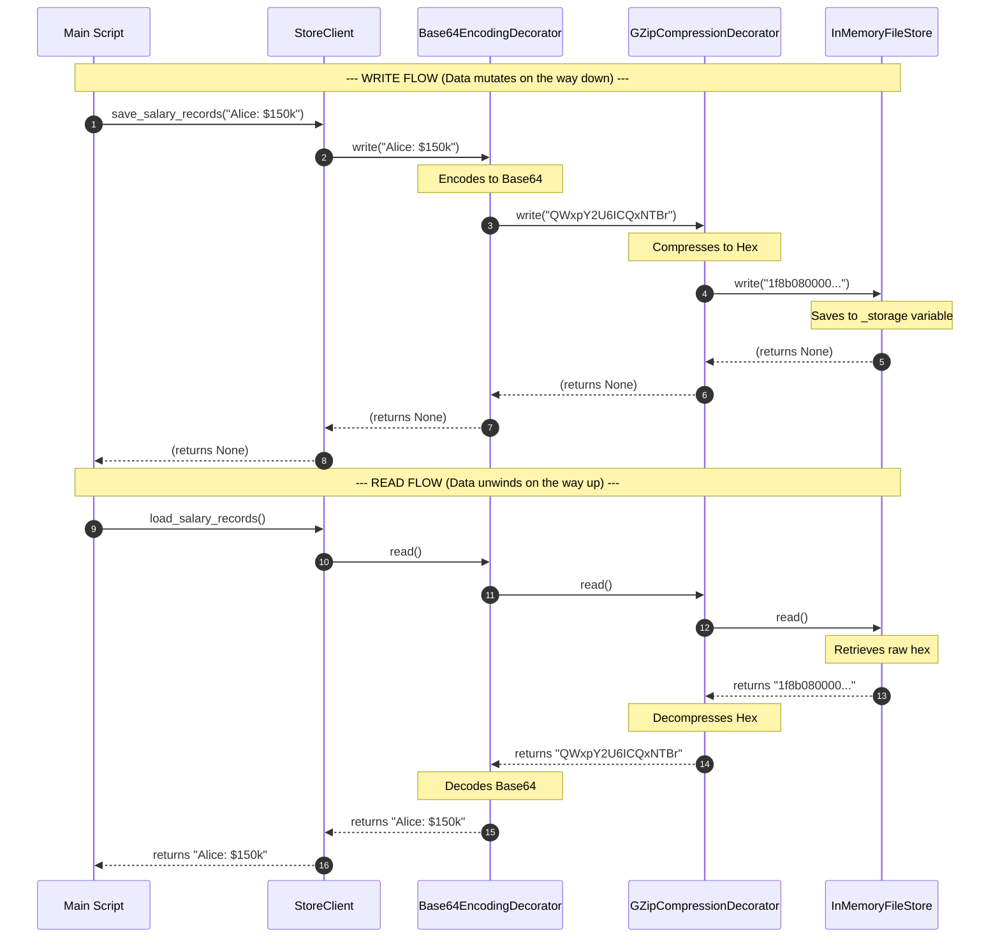

Class Diagram

```mermaid
classDiagram
    class DataStore {
        <<Protocol>>
        +write(data: str)
        +read() str
    }
    
    class InMemoryFileStore {
        -_filename: str
        -_storage: str
        +write(data: str)
        +read() str
    }
    
    class BaseStoreDecorator {
        -_wrappee: DataStore
        +write(data: str)
        +read() str
    }
    
    class Base64EncodingDecorator {
        +write(data: str)
        +read() str
    }
    
    class GZipCompressionDecorator {
        +write(data: str)
        +read() str
    }
    
    class StoreClient {
        -_store: DataStore
        +save_salary_records(records: str)
        +load_salary_records() str
    }

    %% Relationships using your requested terminology
    InMemoryFileStore ..|> DataStore : conforms to
    BaseStoreDecorator ..|> DataStore : conforms to
    Base64EncodingDecorator --|> BaseStoreDecorator : subclasses
    GZipCompressionDecorator --|> BaseStoreDecorator : subclasses
    
    %% The critical aggregation that makes Decorators work
    BaseStoreDecorator o--> DataStore : has a (wraps)
    
    %% The Client only depends on the Protocol
    StoreClient --> DataStore : depends on
```

Sequence Diagram

```mermaid
sequenceDiagram
    autonumber
    participant Main as Main Script
    participant Client as StoreClient
    participant B64 as Base64EncodingDecorator
    participant GZip as GZipCompressionDecorator
    participant Store as InMemoryFileStore

    Note over Main, Store: --- WRITE FLOW (Data mutates on the way down) ---
    
    Main->>Client: save_salary_records("Alice: $150k")
    Client->>B64: write("Alice: $150k")
    
    Note over B64: Encodes to Base64
    B64->>GZip: write("QWxpY2U6ICQxNTBr")
    
    Note over GZip: Compresses to Hex
    GZip->>Store: write("1f8b080000...")
    
    Note over Store: Saves to _storage variable
    Store-->>GZip: (returns None)
    GZip-->>B64: (returns None)
    B64-->>Client: (returns None)
    Client-->>Main: (returns None)

    Note over Main, Store: --- READ FLOW (Data unwinds on the way up) ---
    
    Main->>Client: load_salary_records()
    Client->>B64: read()
    B64->>GZip: read()
    GZip->>Store: read()
    
    Note over Store: Retrieves raw hex
    Store-->>GZip: returns "1f8b080000..."
    
    Note over GZip: Decompresses Hex
    GZip-->>B64: returns "QWxpY2U6ICQxNTBr"
    
    Note over B64: Decodes Base64
    B64-->>Client: returns "Alice: $150k"
    
    Client-->>Main: returns "Alice: $150k"
```
