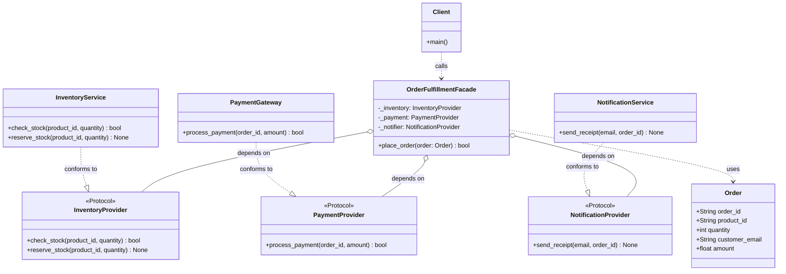
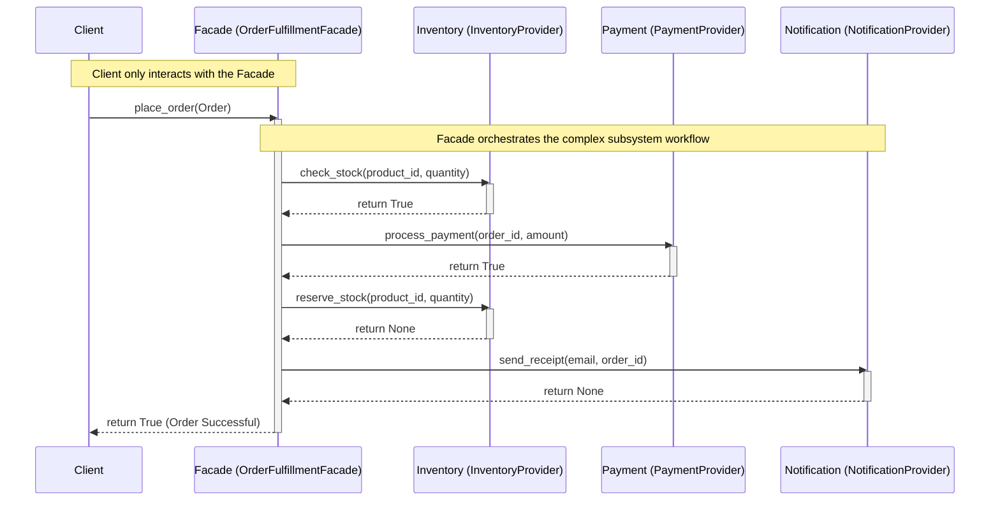

Class Diagram

```mermaid
classDiagram
    class Order {
        +String order_id
        +String product_id
        +int quantity
        +String customer_email
        +float amount
    }

    class InventoryProvider {
        <<Protocol>>
        +check_stock(product_id, quantity) bool
        +reserve_stock(product_id, quantity) None
    }

    class PaymentProvider {
        <<Protocol>>
        +process_payment(order_id, amount) bool
    }

    class NotificationProvider {
        <<Protocol>>
        +send_receipt(email, order_id) None
    }

    class InventoryService {
        +check_stock(product_id, quantity) bool
        +reserve_stock(product_id, quantity) None
    }

    class PaymentGateway {
        +process_payment(order_id, amount) bool
    }

    class NotificationService {
        +send_receipt(email, order_id) None
    }

    class OrderFulfillmentFacade {
        -_inventory: InventoryProvider
        -_payment: PaymentProvider
        -_notifier: NotificationProvider
        +place_order(order: Order) bool
    }

    class Client {
        +main()
    }

    %% Relationships
    InventoryService ..|> InventoryProvider : conforms to
    PaymentGateway ..|> PaymentProvider : conforms to
    NotificationService ..|> NotificationProvider : conforms to

    OrderFulfillmentFacade o-- InventoryProvider : depends on
    OrderFulfillmentFacade o-- PaymentProvider : depends on
    OrderFulfillmentFacade o-- NotificationProvider : depends on
    
    OrderFulfillmentFacade ..> Order : uses
    Client ..> OrderFulfillmentFacade : calls
```

Sequence Diagram

```mermaid
sequenceDiagram
    participant C as Client
    participant F as Facade (OrderFulfillmentFacade)
    participant I as Inventory (InventoryProvider)
    participant P as Payment (PaymentProvider)
    participant N as Notification (NotificationProvider)

    Note over C, F: Client only interacts with the Facade
    C->>F: place_order(Order)
    activate F
    
    Note over F, N: Facade orchestrates the complex subsystem workflow
    
    %% Step 1: Check Stock
    F->>I: check_stock(product_id, quantity)
    activate I
    I-->>F: return True
    deactivate I
    
    %% Step 2: Process Payment
    F->>P: process_payment(order_id, amount)
    activate P
    P-->>F: return True
    deactivate P
    
    %% Step 3: Reserve Stock (only after payment succeeds)
    F->>I: reserve_stock(product_id, quantity)
    activate I
    I-->>F: return None
    deactivate I
    
    %% Step 4: Send Notification
    F->>N: send_receipt(email, order_id)
    activate N
    N-->>F: return None
    deactivate N
    
    %% Final: Return to Client
    F-->>C: return True (Order Successful)
    deactivate F
```
